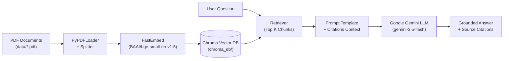

# 📚 RAG Research Assistant

An intelligent, citation-backed **Retrieval-Augmented Generation (RAG)** system designed to ingest, index, and query academic papers and technical documents.

Built with **LangChain**, **FastEmbed** (local ONNX embeddings), **ChromaDB**, **Google Gemini**, and **Streamlit**.

---

## 🌟 Key Features

- **📄 Multi-Document PDF Ingestion**: Ingests individual papers or entire directories of PDFs with automatic chunking and overlap.
- **⚡ Fast ONNX Embeddings**: Uses `BAAI/bge-small-en-v1.5` via FastEmbed for local vector embeddings.
- **📌 Precision Source Citations**: Answers include grounded in-text citations and exact page numbers from source documents.
- **🛡️ Resilient Model Fallback**: Handles high demand and rate limits automatically across Gemini models (`gemini-3.5-flash`, `gemini-3.5-flash-lite`, `gemini-3.8-flash`).
- **💬 Interactive Web UI**: Streamlit web application supporting live PDF upload, document indexing, and chat history.
- **💻 CLI Query Interface**: Quickly query your documents directly from your command line.

---

## 🏗️ Architecture



---

## 🚀 Getting Started

### 1. Prerequisites

- Python 3.10+
- Google Gemini API key ([Google AI Studio](https://aistudio.google.com/))

### 2. Installation

1. **Clone the repository:**
   ```bash
   git clone <repo-url>
   cd RAG_Research_Assistant
   ```

2. **Create and activate a virtual environment:**
   ```bash
   # Windows
   python -m venv venv
   .\venv\Scripts\activate

   # Linux / macOS
   python3 -m venv venv
   source venv/bin/activate
   ```

3. **Install dependencies:**
   ```bash
   pip install -r requirements.txt
   ```

4. **Configure your API Key:**
   Create a `.env` file in the project root:
   ```env
   GEMINI_API_KEY=your_gemini_api_key_here
   ```

---

## 📖 Usage

### Option A: Interactive Web UI (Streamlit)

Launch the browser interface to upload papers and chat interactively:

```bash
streamlit run src/app.py
```

### Option B: CLI Querying

Ask questions directly from your terminal:

```bash
# Ask a specific question
python src/query.py "What is a Markov Decision Process?"

# Run with the default query
python src/query.py
```

### Option C: Ingest New Papers

Place your PDF documents in the `data/` folder and run:

```bash
# Ingest all PDFs in the data folder
python src/ingest.py

# Or ingest a specific PDF file
python src/ingest.py path/to/your_paper.pdf
```

---

## 📁 Project Structure

```
RAG_Research_Assistant/
├── data/                  # Storage folder for PDF documents
├── chroma_db/             # Persistent vector store database
├── src/
│   ├── app.py             # Streamlit interactive web application
│   ├── ingest.py          # PDF document loader, splitter, and vector indexer
│   └── query.py           # RAG retrieval and Gemini generation pipeline
├── .env                   # Environment variables (API keys)
├── .gitignore             # Git ignore rules
├── requirements.txt       # Project dependencies
└── README.md              # Project documentation
```

---

## 📜 License

MIT License. Feel free to customize and extend for your own research workflows!
