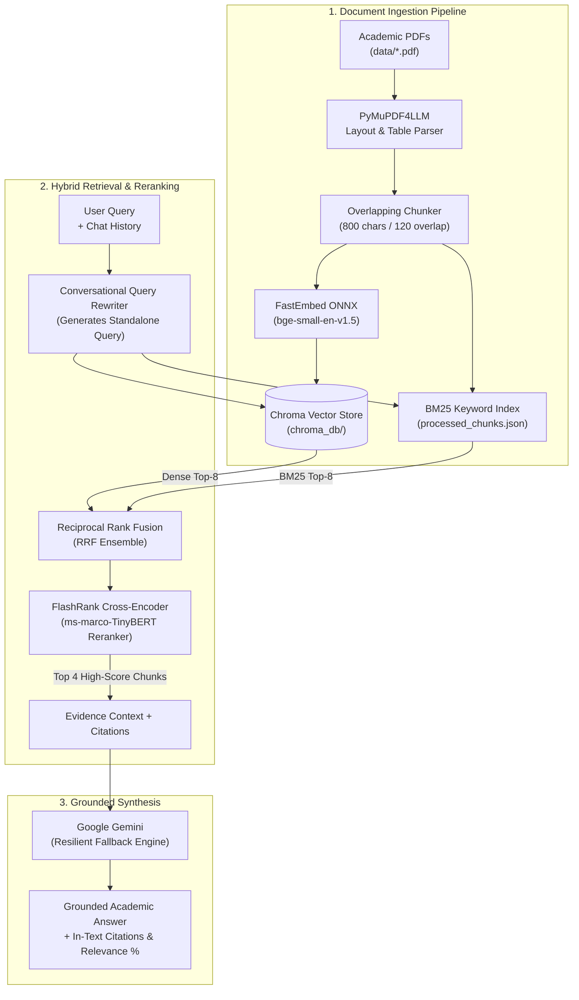

# 🔬 Academic RAG Research Assistant

An advanced, production-grade **Retrieval-Augmented Generation (RAG)** system tailored for academic papers and technical research.

Built with **PyMuPDF4LLM**, **FastEmbed** (local ONNX embeddings), **BM25 Keyword Search**, **FlashRank Cross-Encoder Reranking**, **ChromaDB**, **Google Gemini**, and **Streamlit**.

---

## 🌟 Elite Features

- **📑 Layout-Aware Academic PDF Parsing**: Uses `pymupdf4llm` to preserve two-column paper structures, LaTeX formulas, markdown tables, and section hierarchies without column interleaving.
- **⚡ Hybrid Search Engine**: Fuses **Dense Semantic Vectors** (`bge-small-en-v1.5`) with **Sparse Keyword Search** (`BM25`) using Reciprocal Rank Fusion (RRF) to capture both high-level concepts and exact acronyms/equations.
- **🎯 FlashRank Cross-Encoder Reranking**: Locally scores and filters candidate passages using an ONNX cross-encoder (`ms-marco-TinyBERT-L-2-v2`) for ultra-precise context selection and noise reduction.
- **🧠 Conversational Memory & Query Rephrasing**: Dynamically rewrites follow-up questions into standalone academic search queries based on prior chat history.
- **📌 Precision Source Citations**: Answers include in-text bracket citations `[paper.pdf, Page X]` alongside expandable evidence drawers with cross-encoder relevance scores.
- **🛡️ Resilient Model Fallback**: Automatically cascades across Gemini models (`gemini-3.5-flash`, `gemini-3.5-flash-lite`, `gemini-3.8-flash`) in case of demand spikes or rate limits.
- **💻 Full Stack**: Interactive **Streamlit Web UI** (with paper library catalog and report export) + **Interactive Terminal CLI**.

---

## 🏗️ Architecture



---

## 🚀 Getting Started

### 1. Prerequisites

- Python 3.10+
- Google Gemini API key ([Google AI Studio](https://aistudio.google.com/))

### 2. Installation

```bash
# Clone the repository
git clone <repo-url>
cd RAG_Research_Assistant

# Create and activate virtual environment
python -m venv venv
.\venv\Scripts\activate   # Windows
# source venv/bin/activate # Linux / macOS

# Install dependencies
pip install -r requirements.txt
```

### 3. Environment Configuration

Add your Gemini API key in `.env`:
```env
GEMINI_API_KEY=your_gemini_api_key_here
```

---

## 📖 Usage

### Option A: Interactive Web UI (Streamlit)

```bash
streamlit run src/app.py
```
- Upload PDFs via the sidebar for automatic indexing.
- View indexed papers in the **Indexed Library** panel.
- Chat with multi-turn memory and view FlashRank relevance scores.
- Export your research session as a Markdown report.

### Option B: Interactive CLI Chat Loop

```bash
python src/query.py
```
Enters a multi-turn terminal conversation with memory. Type `exit` to quit, `clear` to reset history.

Or ask a one-off question:
```bash
python src/query.py "Explain Markov Decision Process and how optimal policies are evaluated"
```

### Option C: Document Ingestion

```bash
# Ingest all PDFs in data/
python src/ingest.py

# Or ingest a specific PDF file
python src/ingest.py path/to/paper.pdf
```

---

## 📁 Project Structure

```
RAG_Research_Assistant/
├── data/                      # PDF research papers storage
├── chroma_db/                 # ChromaDB vector store & BM25 catalog
├── src/
│   ├── app.py                 # Streamlit web app with library & export features
│   ├── ingest.py              # PyMuPDF4LLM layout parser & chunk indexer
│   ├── retriever.py           # Hybrid search (Chroma + BM25) + FlashRank reranker
│   └── query.py               # Conversational query rewriter & Gemini pipeline
├── .env                       # API credentials
├── requirements.txt           # Project dependencies
└── README.md                  # Project documentation
```

---

## 📜 License

MIT License.
